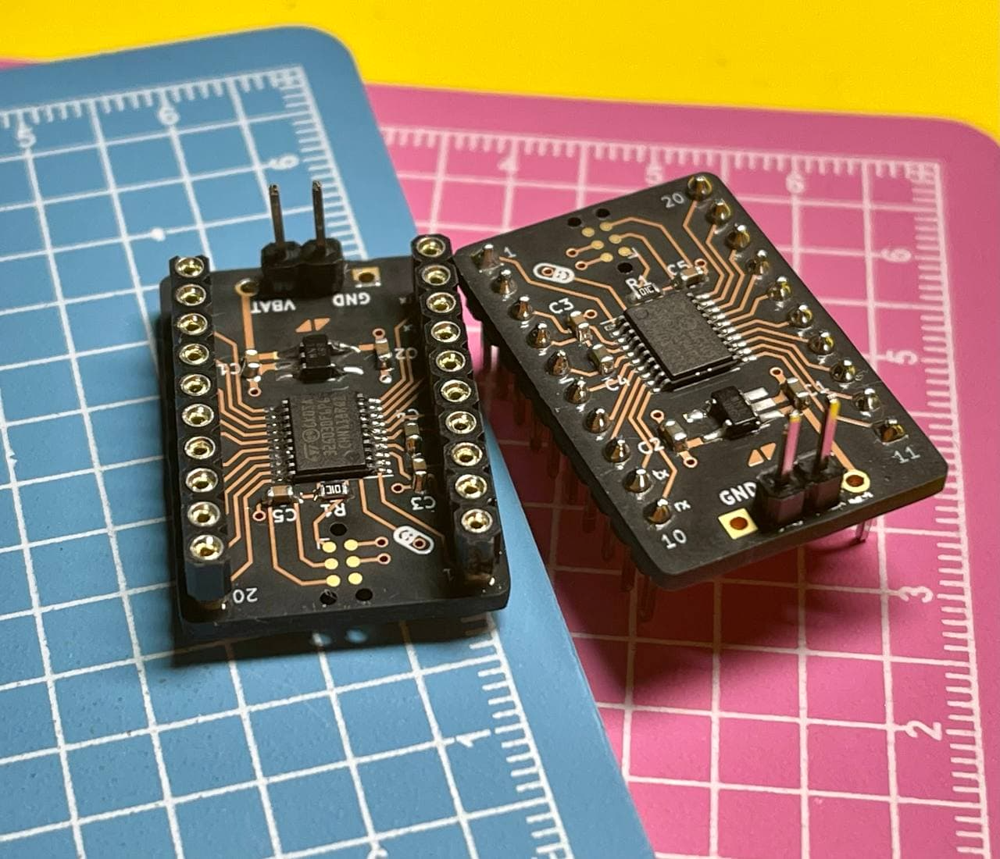

# Placebo

Truly minimal STM32G0xxFx development board.

## Features

* Breadboard/Perfboard friendly
* Power line bypass capacitors
* Reset circuit
* [`Tag-Connect TC2030-CTX-NL`](https://www.tag-connect.com/product/tc2030-ctx-nl-stdc14-for-use-with-stm32-processors-with-stlink-v3) programming connector
* Optional battery connector with LDO

## Resources

- [Schematics](docs/placebo.pdf)
- [Gerber files](docs/placebo.zip)
- [BOM](docs/placebo.csv)

## License

Licensed under either of

- Apache License, Version 2.0 ([LICENSE-APACHE](LICENSE-APACHE) or
  http://www.apache.org/licenses/LICENSE-2.0)
- MIT license ([LICENSE-MIT](LICENSE-MIT) or http://opensource.org/licenses/MIT)

at your option.

### Contribution

Unless you explicitly state otherwise, any contribution intentionally submitted
for inclusion in the work by you, as defined in the Apache-2.0 license, shall be
dual licensed as above, without any additional terms or conditions.
