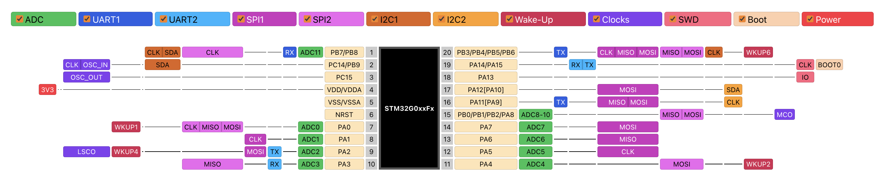

# Placebo

Truly minimal STM32G0/STM32C0 proto board.

## Features

* Breadboard/Perfboard friendly
* Power line bypass capacitors
* Reset circuit
* [`Tag-Connect TC2030-CTX-NL`](https://www.tag-connect.com/product/tc2030-ctx-nl-stdc14-for-use-with-stm32-processors-with-stlink-v3) programming connector
* Optional battery connector with LDO
* Optional configurable LED

## Pinout

## Rust firmware

1. Install rustup by following the instructions at https://rustup.rs
2. Install Cortex-M0, M0+, and M1 (ARMv6-M architecture) target: `rustup target add thumbv6m-none-eabi`
3. Install cargo-binutils: `cargo install cargo-binutils`
4. Install cargo-generate: `cargo install cargo-generate` (Note: on some Linux distros (e.g. Ubuntu) you may need to install the packages libssl-dev and pkg-config prior to installing cargo-generate.)
5. Generate project: `cargo generate --git https://github.com/dotcypress/placebo-template.git`
6. Flash microcontroller: `cargo run`

## Resources

- [Order PCB on Oshpark](https://oshpark.com/shared_projects/Xkl2RPCo)
- [Schematics](docs/placebo.pdf)
- [Gerber files](docs/placebo.zip)
- [BOM](docs/placebo.csv)

## License

Licensed under either of

- Apache License, Version 2.0 ([LICENSE-APACHE](LICENSE-APACHE) or
  http://www.apache.org/licenses/LICENSE-2.0)
- MIT license ([LICENSE-MIT](LICENSE-MIT) or http://opensource.org/licenses/MIT)

at your option.

### Contribution

Unless you explicitly state otherwise, any contribution intentionally submitted
for inclusion in the work by you, as defined in the Apache-2.0 license, shall be
dual licensed as above, without any additional terms or conditions.
